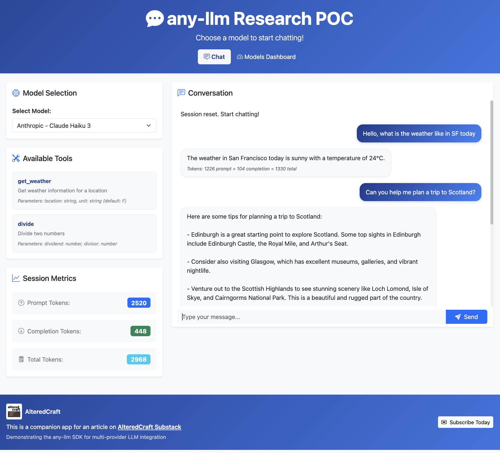
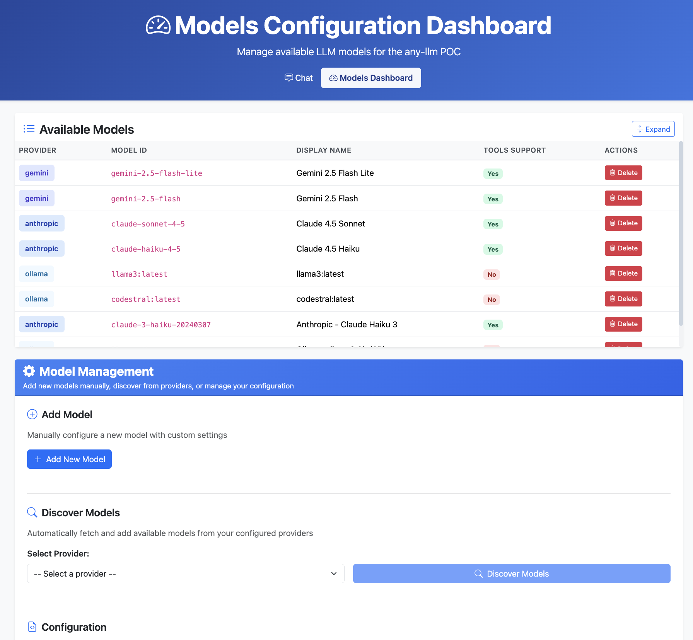

# any-llm Reseach POC

A simple web application demonstrating the [any-llm](https://github.com/mozilla-ai/any-llm) SDK's ability to switch between different LLM providers (Anthropic, Gemini) with direct provider calls.

> **This is the companion app for this Altered Craft article: [Testing Mozilla's any-llm: A Practical Take on Provider Abstraction](https://alteredcraft.com/p/testing-mozillas-any-llm-a-practical)**



## Features

- **Model Selection**: Choose between different LLM providers (Gemini, Claude)
- **Chat Interface**: Simple, clean chat UI
- **Per-Message Token Tracking**: See token usage for each message
- **Session Metrics**: Track cumulative tokens per session (resets when switching models)

## Prerequisites

- **Python 3.13+** with [uv](https://github.com/astral-sh/uv) installed
- **Provider API Keys**: Any of your choosing which are [supported by Any-llm](https://mozilla-ai.github.io/any-llm/providers/)


## Setup

1. **Clone the repository**

2. **Create your `.env` file**:
   ```bash
   cp .env.example .env
   ```

3. **Edit `.env` and add your API keys**:
see: https://mozilla-ai.github.io/any-llm/providers/ for KEY names
   ```
   ANTHROPIC_API_KEY=your_anthropic_key_here
   GOOGLE_API_KEY=your_google_key_here
   ```

4. **Install dependencies**:
   ```bash
   uv sync
   ```

## Running the Application

Start the FastAPI server:

```bash
uv run uvicorn app:app --reload
```

Or use the built-in runner:

```bash
uv run python app.py
```

The application will be available at: **http://localhost:8000**

## Usage

1. Open your browser to `http://localhost:8000`
2. Select a model from the dropdown
3. Start chatting!
4. Watch the token metrics update after each response
5. Switch models to reset the session and start fresh

## Architecture

- **Backend**: FastAPI (single file `app.py`)
- **Frontend**: Vanilla HTML/CSS/JavaScript (in `static/` directory)
- **API Integration**: any-llm SDK calling providers directly (no proxy/gateway)

## API Endpoints

- `GET /` - Serve the web interface
- `GET /api/models` - List available models
- `POST /api/chat` - Send a chat message and get completion

## Customization



To add or modify available models, navigate to http://localhost:8000/dashboard or edit `models_config.json` directly

